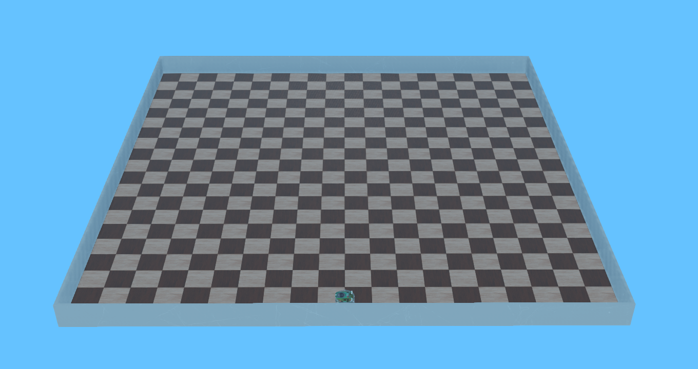
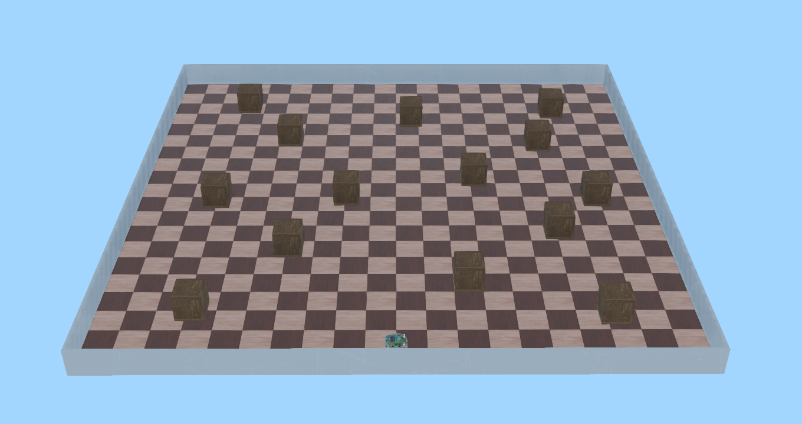
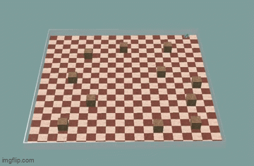

# A Hybrid EWC-Replay Continual Reinforcement Learning Approach for Robotic Target Search

> A continual reinforcement learning pipeline that trains an e-puck robot to search for hidden targets across sequential Webots environments — without forgetting how to navigate previous ones.


---

## Table of Contents

- [About](#about)
- [Key Features](#key-features)
- [Environments](#environments)
- [Method](#method)
- [Results](#results)
- [Project Structure](#project-structure)
- [Getting Started](#getting-started)
- [Usage](#usage)
- [Metrics](#metrics)
- [Tech Stack](#tech-stack)
- [Acknowledgments](#acknowledgments)
- [Authors](#authors)
- [License](#license)

---

## About

This project addresses a core challenge in robotics: how can a robot learn to search for a hidden target in one environment and then adapt to new, harder environments **without losing** the skills it already learned?

We frame this as a **continual reinforcement learning (CRL)** problem. A single Double DQN policy is trained sequentially across three Webots scenes of increasing difficulty. The robot does not know where the target is — it must explore using only local information until it gets close enough for the target to be "revealed," then switch to a learned approach behavior to reach it.

To combat **catastrophic forgetting**, the pipeline supports two complementary mechanisms:

- **Selective Search Episode Replay (SSER)** — replays high-quality past episodes during new-scene training.
- **EWC-style regularization** — penalizes changes to network weights that were important for earlier scenes.

This was developed as a graduate course project at the **American University of Sharjah**.

---

## Key Features

- **Target-revealing navigation** — two-phase reward system with hidden-target search and post-reveal homing.
- **Four training variants** — `dqn` (baseline), `dqn_replay` (SSER), `dqn_ewc` (EWC), `dqn_replay_ewc` (combined).
- **Automated experiment orchestration** — schedule scripts handle sequential training, evaluation, and artifact passing across scenes.
- **Per-episode logging** — tracks reveal rate, reach rate, coverage, collisions, decision steps, and episode reward.
- **Forgetting and transfer metrics** — computes forgetting, SASR, ASR, and search efficiency from evaluation logs.

---

## Environments

All scenes use a 2m × 2m arena with an e-puck robot.

| Scene | Description | Challenge |
|:---:|---|---|
| **T₁** | Empty room | Learn systematic room-sweeping search patterns with minimal revisits |
| **T₂** | Static obstacles | Adapt search strategy to navigate around clutter |
| **T₃** | Dynamic obstacles | React to moving obstacles; static mental maps no longer work |

---


<div align="center" style="padding: 2em 0;">

<table>
<tr>
<td align="center">
<br>
<em>T₁ — Empty arena with the e-puck at the start</em>
</td>
<td align="center">
<br>
<em>T₂ — Cluttered arena with static obstacles</em>
</td>
</tr>
</table>

<br>

<br>
<em>T₃ — Dynamic arena with moving obstacles</em>

</div>


## Method

### Double DQN Controller

The policy is a compact MLP (19 → 256 → 256 → 3) trained with Double DQN, Huber loss, and soft target-network updates.

### State Space (Observation Vector)

The policy receives a 19-dimensional observation at each decision step:

| # | Features | Description |
|:---:|---|---|
| 4 | `v_f, v_r, v_l, v_b` | Heading-aligned local visited/blocked flags (front, right, left, back) |
| 1 | `d_dwell` | Normalized dwell feature — penalizes staying in the same cell |
| 1 | `ℓ` | Loop score — detects repetitive small-loop motion |
| 8 | `p₀ … p₇` | Normalized proximity sensor readings |
| 2 | `sin θ, cos θ` | Robot heading representation |
| 1 | `d̂_t` | Normalized target distance (zeroed before reveal) |
| 2 | `sin φ, cos φ` | Target bearing representation (zeroed before reveal) |

Before the target is revealed, the last three target-relative features are set to zero, hiding the target from the policy. After reveal, they become active.

### Action Space

The robot uses three discrete macro-actions:

| Index | Action | Description |
|:---:|---|---|
| 0 | `forward` | Move forward by one grid cell (0.1 m) |
| 1 | `rotate_right` | Rotate 90° clockwise |
| 2 | `rotate_left` | Rotate 90° counter-clockwise |

### Two-Phase Reward

| Phase | Objective |
|---|---|
| **Search** (pre target reveal) | Explore efficiently |
| **Homing** (post target reveal) | Reach the target |

### Continual Learning Mechanisms

**SSER** stores the top K=10 highest-scoring episodes (by search efficiency) from each completed scene. During later-scene training, 25% of each minibatch is drawn from stored old-scene transitions.

**EWC** saves a parameter anchor and diagonal importance estimate after each scene. A regularization penalty discourages changes to important weights during subsequent training.

---

## Results

All variants trained for 2000 episodes per scene, evaluated over 100 episodes with fixed seeds.

### Main Metrics

| Policy | F(T₂) ↓ | F(T₃) ↓ | SASR ↑ | ASR ↑ |
|---|:---:|:---:|:---:|:---:|
| `dqn` | 0.01 | 0.07 | 0.970 | 0.953 |
| `dqn_ewc` | 0.06 | 0.05 | 0.937 | 0.932 |
| `dqn_replay` | 0.03 | **0.025** | **0.963** | **0.955** |
| `dqn_replay_ewc` | 0.07 | **0.00** | 0.960 | **0.955** |

### Per-Scene Reach Rate

| Policy | A₀(T₀) | A₀(T₁) | A₀(T₂) | A₁(T₁) | A₁(T₂) | A₂(T₂) |
|---|:---:|:---:|:---:|:---:|:---:|:---:|
| `dqn` | 1.00 | 0.99 | 0.94 | 0.96 | 0.88 | 0.95 |
| `dqn_ewc` | 1.00 | 0.94 | 0.89 | 0.94 | 0.95 | 0.87 |
| `dqn_replay` | 1.00 | 0.97 | 0.98 | 0.92 | 0.89 | 0.97 |
| `dqn_replay_ewc` | 1.00 | 0.93 | 0.95 | 0.92 | 0.97 | 0.96 |

### Search Efficiency

| Policy | E₀(T₀) | E₀(T₁) | E₀(T₂) | E₁(T₁) | E₁(T₂) | E₂(T₂) | **Avg** |
|---|:---:|:---:|:---:|:---:|:---:|:---:|:---:|
| `dqn` | 0.861 | 0.839 | 0.833 | 0.768 | 0.708 | 0.728 | 0.799 |
| `dqn_ewc` | 0.864 | 0.838 | 0.782 | 0.738 | 0.701 | 0.692 | 0.769 |
| `dqn_replay` | 0.861 | 0.862 | 0.871 | 0.765 | 0.751 | 0.809 | **0.820** |
| `dqn_replay_ewc` | 0.864 | 0.798 | 0.789 | 0.718 | 0.698 | 0.679 | 0.758 |

**Key finding:** Selective episode replay (`dqn_replay`) gave the strongest overall retention — tying for the highest ASR and achieving the best average search efficiency. EWC helped in some later-stage evaluations but was less consistent. The combined variant showed a tradeoff between retention and search efficiency.

---

## Project Structure

```
crl_webots/
├── src/
│   ├── controllers/
│   │   ├── rl_controller/
│   │   │   ├── rl_controller.py              # Main Webots controller entry point
│   │   │   └── utils/
│   │   │       ├── dqn_policy.py              # Episode loop, transitions, CRL handling
│   │   │       ├── actions.py                 # Macro-actions (forward, rotate)
│   │   │       ├── cell_tracker.py            # GPS-based grid tracking, visited/blocked cells
│   │   │       ├── component_manager.py       # Webots device initialization
│   │   │       ├── position_related.py        # Target sampling, reveal/reach detection
│   │   │       ├── rl_helper.py               # Observation construction, reward functions
│   │   │       ├── rl_specific/
│   │   │       │   ├── architecture.py        # DQN network (MLP 19→256→256→3)
│   │   │       │   ├── dqn_manager.py         # DQN training, action selection, CRL flags
│   │   │       │   ├── buffer.py              # ReplayBuffer, PriorityBuffer, ReservoirBuffer
│   │   │       │   └── ewc_files/             # EWC implementation (ewc.py, module_parameters.py)
│   │   │       └── misc/                      # Sensor reading, motor control, logging, metrics
│   │   └── dynamic_obstacles_controller/      # Controller for T₃ moving obstacles
│   └── worlds/                                # Webots world files
│       ├── scene_1_empty.wbt
│       ├── scene_2_obstacles.wbt
│       └── scene_3_dynamic.wbt
├── schedules/
│   ├── helper.py                              # Webots batch runner, scene mapping, constants
│   ├── dqn_schedule.py                        # Baseline sequential schedule
│   ├── dqn_replay_schedule.py                 # SSER schedule
│   ├── dqn_ewc_schedule.py                    # EWC schedule
│   └── dqn_replay_ewc_schedule.py             # Combined SSER + EWC schedule
├── docs/                                      # Scene images and GIFs for README
├── project_docs/                              # Detailed project documentation
├── calculate_metrics.py                       # Post-run metric computation from eval logs
├── runs/                                      # Output directory (logs, models, CRL artifacts)
├── requirements.txt
└── README.md
```

---

## Getting Started

### Prerequisites

- **[Webots R2025a](https://cyberbotics.com/)** — must be installed and the `webots` command available on PATH.
- **Python 3.12**
- **CUDA-capable GPU** (recommended) — the code uses PyTorch with CUDA when available, but falls back to CPU.

### Installation

We recommend installing dependencies into a **conda environment** to avoid conflicts with system packages:

```bash
git clone https://github.com/<your-username>/crl_webots.git
cd crl_webots

conda create -n crl_webots python=3.12 -y
conda activate crl_webots
pip install -r requirements.txt
```

> **Note:** The `requirements.txt` includes `torch==2.11.0+cu126`. If you are on a different CUDA version or CPU-only, install the appropriate PyTorch build from [pytorch.org](https://pytorch.org/get-started/locally/) before running `pip install`.

### Configuring Webots to Use the Conda Environment

Webots needs to know where your conda Python is. After activating your environment:

1. Open Webots.
2. Go to **Tools → Preferences**.
3. In the **Python command** field, enter the full path to your conda environment's Python executable, e.g.:
   ```
   C:\Users\<your-username>\anaconda3\envs\crl_webots\python.exe
   ```
   On Linux/macOS:
   ```
   ~/anaconda3/envs/crl_webots/bin/python
   ```
4. Click **OK** and restart any running simulations.

---

## Usage

### Running a Full Experiment

Each training variant has a corresponding schedule script that handles the full sequential train → evaluate → save pipeline:

```powershell
# Baseline (fine-tuning only)
python schedules/dqn_schedule.py

# Selective Search Episode Replay
python schedules/dqn_replay_schedule.py

# EWC-style regularization
python schedules/dqn_ewc_schedule.py

# Combined SSER + EWC
python schedules/dqn_replay_ewc_schedule.py
```

Each schedule automatically:
1. Trains on T₁ → T₂ → T₃ sequentially (2000 episodes each).
2. Evaluates on all previously seen scenes after each training stage (100 episodes each).
3. Saves model checkpoints, logs, and CRL artifacts to `runs/<policy>/`.

### Computing Metrics

After a schedule completes, compute success rate and search efficiency from evaluation logs:

```bash
python calculate_metrics.py
# Enter the policy name when prompted: dqn, dqn_replay, dqn_ewc, or dqn_replay_ewc
```

Results are saved as `<policy>-metrics.json` in `runs/<policy>/`.

### Opening in Webots GUI

To inspect a scene visually, open the corresponding world file in Webots:

```
src/worlds/scene_1_empty.wbt
src/worlds/scene_2_obstacles.wbt
src/worlds/scene_3_dynamic.wbt
```

---

## Metrics

| Metric | Description |
|---|---|
| **Reach Rate** | Fraction of episodes where the target was reached (primary metric) |
| **Forgetting F(Tₖ)** | Average performance drop on earlier scenes after training on Tₖ |
| **SASR** | Scene-averaged success rate — mean reach rate evaluated right after training each scene |
| **ASR** | Average success rate across all scene–stage evaluation pairs |
| **Search Efficiency φ(e)** | (unique cells − collisions) / decision steps per episode |

---

## Tech Stack

| Component | Technology |
|---|---|
| Simulator | [Webots R2025a](https://cyberbotics.com/) |
| Robot | e-puck (differential drive) |
| RL Framework | Custom PyTorch Double DQN |
| Language | Python 3.12 |
| Deep Learning | PyTorch 2.11 (CUDA 12.6) |
| Data | Pandas |

---

## Acknowledgments

- The DQN implementation was adapted from the [PyTorch Reinforcement Q-Learning Tutorial](https://docs.pytorch.org/tutorials/intermediate/reinforcement_q_learning.html).
- The EWC implementation was taken from [pettza/EWC](https://github.com/pettza/EWC).

---

## Authors

**Hady Mahmoud**, **Youssef Ghoneim**, and **Youssef Elmadany**  
American University of Sharjah

---

## License

This project is licensed under the [MIT License](LICENSE).
